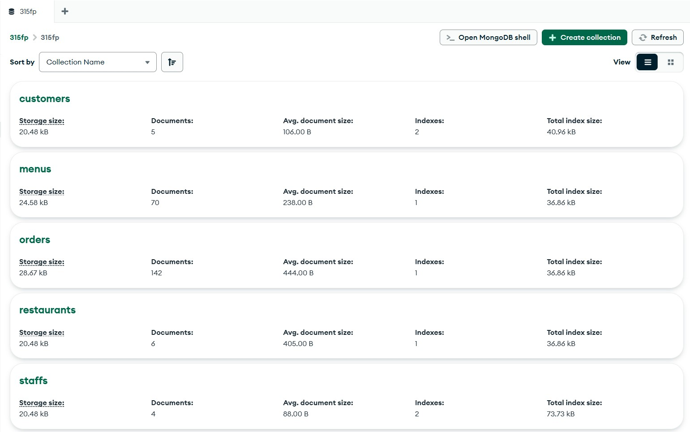
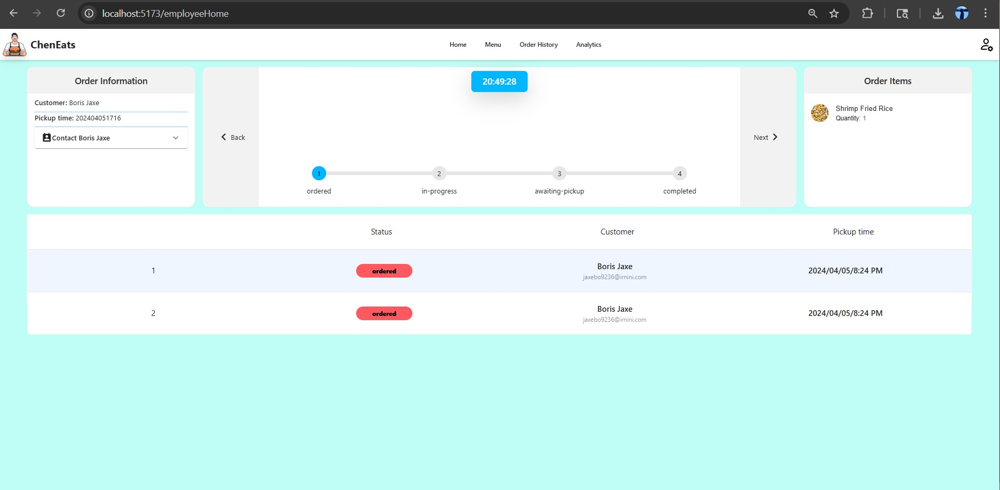
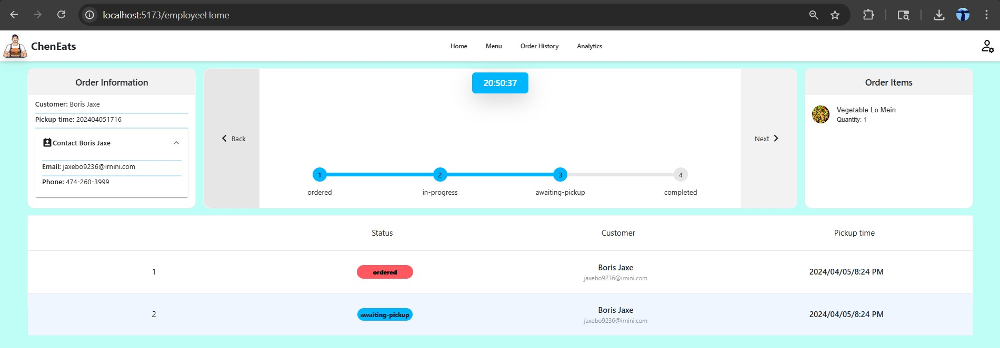
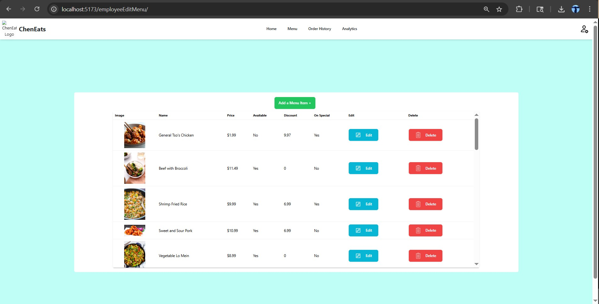
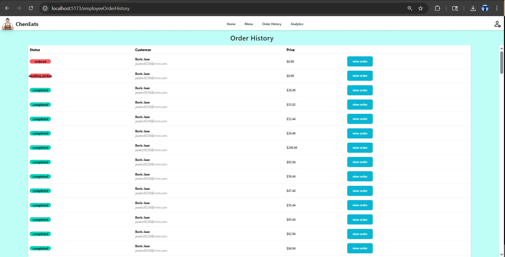
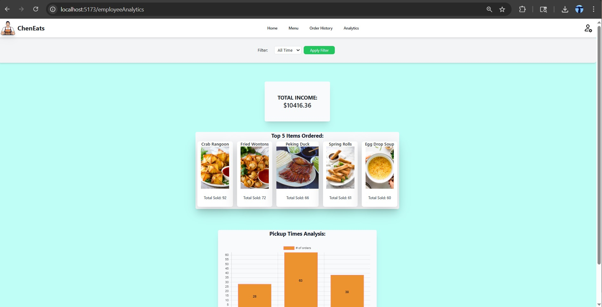

# ChenEats

## 📊 Web Site Images

-Dev Buttons to auto sign into and verify either eomployee or customer account
-Standard Login Page (uses cookies for sessions)

-Compass overview of entire database and collection (test data)
-View of all tables

---

## 📊 Customer Side 

-View all restaurants
-View active orders
-Navigation bars are sticky and site wide

---

-Standard ordering page from customer selected restaurant
-Dynamic and resposive order creation and carting, supported up by mongodb and cookies

---

-Schedule a pickup time
-Delivary or pickup options

---

- View all oders for thr current customer

---

## 📊 Restaurant Side

-Overview of current orders
-Active order processing/editing
-Sticky nav bar available across entire site

---

-Examples of processing active orders

---

-Ability to edit menu for restaurants 

---

-View all orders from the restauarant

---

- View busiest time of day
- Most popular items
- Net revenue
- Yearly/Monthly/Daily filters for all analytics
---

